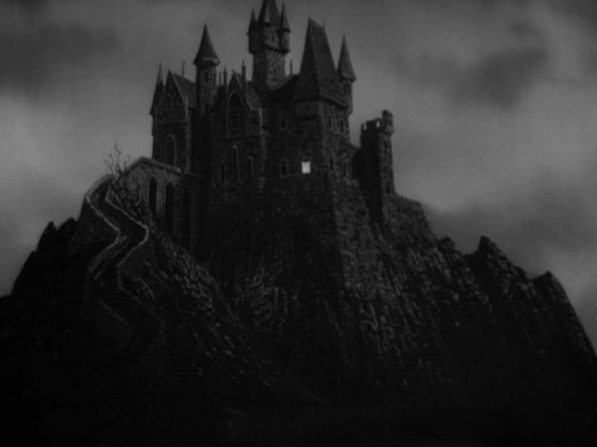

[Torna a campagna](./campaign.md)

# Luoghi
{:.no_toc}

* Indice
{:toc}

[Mappa interattiva](https://www.redgiantmaps.com/maps/exandria)

[Pagina wiki del continente](https://criticalrole.fandom.com/wiki/Wildemount)

## Principali


### Ardeal

Villaggio abbandonato poco a sud della [Fermata per Carovane dell'Anello di Smeraldo](#fermata-per-carovane-dellanello-di-smeraldo), in una posizione centrale di Xhorhas.

Vi si trova la sede della Gilda: [Castel Fres'tynn](#castello-frestynn) e gli edifici limitrofi.

### Castello Fres'tynn

{: width="600" }

Castello un tempo appartenuto a [Noxis Fres'tynn](./npc.md#noxis-frestynn), nonna di Kynthea. Molto grande, e perlopiù saccheggiato. Chissà cosa contiene, nei suoi anfratti?

## Regioni


*wip*

## Città


### Rosonha

{: width="600" }
{: width="400" }

Rosonha è la capitale della Dinastia Kryn, costruita sulle rovine di Ghor Dranas, un tempo base degli dei malvagi. In elfico drow, significa "rinascita".

{: width="400" }

Divisa in tre distretti principali:

* **Corone.** Zona povera, e coltivazioni di superficie.
 
{: width="300" }

* **Guazzabuglio.** Edifici in molti stili diversi, dal drow al Dwendaliano, e ceto medio.

* **Firmamenti.** Zona centrale, con ville nobiliari e luoghi politici e di culto più importanti, insieme a luoghi di apprendimento. Edifici geometrici gotici.

{: width="300" }
* **Terre fantasma.** Esterno di Rosonha, terre infestate da fantasmi che stanno venendo man mano riconquistate.

### Jigow

{: width="340" }

[Pagina wiki](https://criticalrole.fandom.com/wiki/Jigow)

Un insieme di villaggi cresciuto fino ad unirsi nell'unica città portuale della Dinastia Kryn. 

Situata sulla costa nord di Xhorhas, nel Golfo di Smeraldo, alla foce del fiume Ifolon.

  

### Urzin

{: width="400" }

[Pagina wiki](https://criticalrole.fandom.com/wiki/Urzin)

Villaggio semovente per la Palude di Velofranto, a ovest di Xhorhas, sulla schiena di enormi testuggini reggiorizzonte, più una miriade di tende e rifugi mobili. Abitato principalmente da goblinoidi e orchi.

La posizione del villaggio è variabile, come il numero di effettive abitazioni, dato che a volte le testuggini vanno per strade diverse portando a periodiche separazioni e riunioni del villaggio.

## Luoghi d'interesse


### Fermata per Carovane dell'Anello di Smeraldo
{: width="300" }

Piccolo boschetto mantenuto da delle driadi, al centro tra le strade principali di Xhorhas: la Via Consacrata, tra Asarius e Rosonha, e l'Anello di Smeraldo, verso Jigow. 

Spesso le carovane si fermano in questo punto di verde nelle terre desolate.

### Khuramunz

Villaggio sul fiume Ifolon, che è stato assediato da un branco di cinghiali della tempesta.

Circa 780 abitanti, basato su agricoltura e pesca.