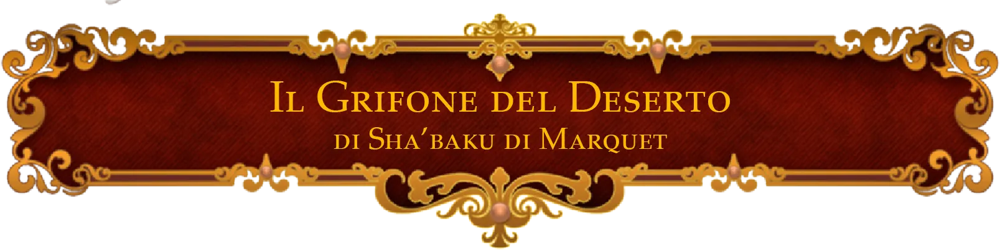

[Torna a campagna](./campaign.md)

Nuove merci evidenziate con freccia di questo colore

Merci tornate disponibiili evidenziate con freccia di questo colore

Alcune merci sono "su richiesta" perchè sono di uso comune, ma generalmente possono craftare tutte le altre cose craftabili se avete materiali ecc.

# Negozi

I vari negozianti vendono direttamente _solo_ le cose elencate nella tabella, oppure oggetti base che abbiano senso; altri magici se non elencati no. Però alcuni sanno costruire oggetti, vedi sotto.

Per riferimento a prezzi di crafting vedi [Regole/Crafting](regole.md#crafting) e [il PDF gratuito](pdf/crafting_free_version_reddit.pdf).

Gli oggetti sono presenti o sul pdf del crafting gratuito linkato sopra, oppure sul manuale completo linkato sul drive (doc "link a manuali"), oppure
sull'_altro sito_ sempre usando le cose incluse nel drive. Quelli che riesco/ho voglia li metto pure qui sul sito, nel caso non
possa linkare la fonte originale per ragioni.

-   Nota: al momento non ho ancora fatto una pagina del sito per gli oggetti che sarebbero nei pdf perchè ho già perso troppe ore su sta
    pagina, comunque o sono linkati o stanno dentro al pdf nella sezione corrispondente (nel caso chiedetemi, se sono traduzioni non immediate).

*   Indice
    -   [Arcanerie diaboliche di Mavreus Vessac](#arcanerie-diaboliche-di-mavreus-vessac)
        -   [Negozio](#negozio)
    -   [Il Grifone del Deserto](#il-grifone-del-deserto)
        -   [Negozio](#negozio-1)
    -   [Mastro Ner Tör](#mastro-ner-tör)
        -   [Negozio](#negozio-2)
    -   [Alchimia botanica](#alchimia-botanica)
        -   [Negozio](#negozio-3)

### Negozianti costruttori

Alcuni negozianti sono in grado di costruire oggetti usando il sistema spiegato a [regole/costruzione](regole.md#costruzione).

Voi gli date semplicemente materiali (se non li hanno già) e soldi e dopo un po' di tempo creano l'oggetto. Chiedete a me per quanto costa e quanto tempo ci vuole in base a cosa volete fare, e quali materiali gli date/quali hanno già.
L'elenco di quali materiali hanno già sta nella loro tabella del negozio. Per come funziona se voleste saperlo, scrivo sotto.

Loro non fanno tiri, usano sempre la regola opzionale per prendere 10 nel doppio del tempo, impegando 4 ore
invece che 2 per "tiro".

**Prezzo.** Per il prezzo chiedete a me, che poi calcolo (indi per cui meglio fare fuori sessione per non perderci tempo). Il prezzo è calcolato con la formula del manuale: in poche parole, in base alla difficoltà della costruzione dell'oggetto, ogni "tiro" costa un certo ammontare di denaro. Vedi il [PDF gratuito](pdf/crafting_free_version_reddit.pdf) a **pg. 95**.
Per esempio, un oggetto di difficoltà 15, e che impiega 4 tiri, costerà 18\*4 = 72mo, oltre ai materiali, e
impiegherà 16 ore (4 per "tiro") per essere costruito.

**Materiali.** Alcuni negozianti hanno già alcuni materiali, che possono vendere, gli altri li dovete fornire voi, o in certi casi ordinare da fuori. Gli NPC possono anche semplicemente comprare materiali che pensate che non
vi possano servire.

-   Il prezzo dei materiali base sta a pagina 11 del [PDF gratuito](pdf/crafting_free_version_reddit.pdf).

-   Ordinare materiali da fuori costa più soldi e tempo, per farli arrivare.

| Rarità     | Costo extra | Tempo extra   |
| ---------- | :---------: | ------------- |
| Non comune |     50      | 1d4 giorni    |
| Raro       |     300     | 1d4 settimane |

**Pergamene.** Molti oggetti magici richiedono pergamene di un certo incantesimo come materiali. Non includo ogni
pergamena come possibile materiale, chiedete e gli NPC potrebbero averla, nel caso. NPC in grado di fare magie
possono sostituire alla pergamena slot a seconda, quindi potrebbe anche essere quello il caso, e possono creare pergamene per magie che sanno fare (prezzo delle pergamene a pagina 89 del [PDF gratuito](pdf/crafting_free_version_reddit.pdf))

-   Per chi di voi sa fare magie, potete sostituire a una pergamena "voi", nel senso che potete aiutare durante il crafting facendo la magia. Solo per una pergamena per crafting, però.

**Competenza.** Gli NPC hanno una certa competenza, che indica la CD massima degli oggetti che possono costruire senza
tirare. Possono provare a costruire oltre, ma dovranno fare i tiri necessari, e se falliranno i materiali andranno
persi. In base al tipo di oggetto che vi serve, trovate l'NPC con la competenza giusta, tipo _incantatore_ per la
maggior parte degli oggetti magici.

## Arcanerie Diaboliche di Mavreus Vessac

_Artefice tiefling decisamente impulsivo_

> Una piccola modifica qua e... oh no. Però che figata!

{: width="300" }

**Gestore:** [Mavreus Vessac](npc.md#mavreus-vessac)

### Costruttore

**Discipline:**

-   _Incantatore_: CD 22
-   _Inventore_: CD 22
-   _Scriba di rune, accademico_: CD 22
-   _Ingegnere_: CD 20
-   _Creatore di bacchette magiche_: CD 20
-   _Intagliatore_: CD 18
-   _Carpentiere_: CD 17
-   _Fabbro_: CD 16

**Moltiplicatore di prezzo:** 1x

Può costruire diversi tipi di oggetti magici e affini. Ricette e prezzi per gli oggetti di questo tipo stanno sotto, in ordine, alle sezioni di

-   _Enchanting_: oggetti magici
-   _Runecarving_: miglioramenti specifici per alcuni tipi di oggetti, solo categoria "accademica", solo nel manuale completo
-   _Wand whittling_: bacchette magiche e scettri
-   _Tinkering_: alcuni oggetti meccanici non magici particolari, come rampini, autocaricatori, freccie speciali, ecc; cose a molla, orologeria, e quant'altro.

Il tutto (tranne _runecarving_ e _tinkering_ che sono solo sul manuale completo) è presente sul solito [PDF gratuito](pdf/crafting_free_version_reddit.pdf).

Utili meno spesso _woodcarving_, roba di legno varia, _engineering_, creazione di grandi strutture, trappole, e macchine da battaglia.

### Negozio

Oltre a quelli elencati vende anche tutti gli oggetti di basso prezzo nella sezione _tinkering_ del manuale completo del crafting.

| Nome                                                                                                                                           |   Prezzo   | Rarità     | Quantità |
| ---------------------------------------------------------------------------------------------------------------------------------------------- | :--------: | ---------- | :------: |
| Lanterna a lente sporgente                                                                                                                     |     10     | comune     |    5     |
| Lanterna coperta                                                                                                                               |     5      | comune     |    5     |
| [_Ordinario bastone da passeggio_](https://dungeon_strugglers.artstation.com/projects/rAnvkm)                                                  |    180     | comune     |    1     |
| Rampino                                                                                                                                        |     7      | comune     |    7     |
| Rampino migliorato¹                                                                                                                            |    100     | non comune |    1     |
| Armi +1 (qualunque arma del manuale)                                                                             | base + 500 | non comune |    6     |
| _Borsa conservante_                                                                                                                            |    1000    | non comune |    3     |
| ~~_Borsa dei trucchi_~~                                                                                                                        |    520     | non comune |    0     |
| _Stivali elfici_                                                                                               |    470     | non comune |    2     |
| _Guanti del potere orchesco_ (19 FOR)                                                                                  |    500     | non comune |    1     |
| [_Runa dell'Abilità (Skill)_](oggetti#runa-dellabilità)                                                                                        |    550     | non comune |    2     |
| [_Lenti dell'aquila_](https://dungeonedraghi.it/compendio/oggetti-magici/oggetti-meravigliosi/lenti-dellaquila/)      |    550     | non comune |    1     |
| [_Stivali alati_](https://dungeonedraghi.it/compendio/oggetti-magici/oggetti-meravigliosi/stivali-alati/)             |    1250    | non comune |    1     |
| [_Lanciafiamme dell'alchimista_](https://old.reddit.com/r/TheGriffonsSaddlebag/comments/udwzsx/the_griffons_saddlebag_alchemists_firethrower/) |    1000    | raro       |    1     |
| [Fuoco dell'alchimista](https://roll20.net/compendium/dnd5e/Alchemist%27s%20Fire#content)                                                      |     20     | comune     |    9     |
| [_Mantello della protezione_](https://dungeonedraghi.it/compendio/oggetti-magici/oggetti-meravigliosi/mantello-della-protezione/)              |    1600    | raro       |    2     |
| Scudo +2                                                                                                            |    2000    | raro       |    1     |
| [_Scudo anti-incantesimi_](https://dungeonedraghi.it/compendio/oggetti-magici/armature/scudo-anti-incantesimi/)       |    2800    | molto raro |    1     |
| Munizioni avanzate (vedi manuale)                                                                                                              |   varia    | varia      |    -     |
| **Materiali**                                                                                                                                  |    ---     | ---        |   ---    |
| Essenza arcana comune (gemma draconica di Eberron)                                                              |     45     | comune     |    19    |
| Essenza divina comune (gemma draconica di Syberys)                                                              |     45     | comune     |    11    |
| Essenza arcana non comune                                                                                       |    150     | non comune |    5     |
| Inchiostro magico non comune                                                                                    |     40     | non comune |    7     |
| Inchiostro magico comune                                                                                                                       |     15     | comune     |    14    |
| Reagente comune                                                                                                                                |     15     | comune     |    -     |
| Reagente non comune                                                                                                                            |     40     | non comune |    25    |

¹ As an action, or in place of an attack as
part of the Attack action, you may target a surface, object
or creature within 20 feet. If the target is Small or smaller,
you can make a Strength (Athletics) grappling check to pull
it to you and grapple it. Alternatively, if the target is
Medium or larger, you can choose to be pulled to it,
however, this doesn’t grapple it. Opportunity attacks
provoked by this movement are made with disadvantage.

² Gittata aumentata a 18m, invece dei 6m base. Muoversi oltre 9m richiede un'azione e il movimento.

## Il Grifone del Deserto

_Studioso e mercante di oggetti magici_

> Benvenuti, benvenuti. Ogni merce qua ha la sua storia, sapete?

{: width="800" }

**Gestore**: [Shaba-ku di Marquet](npc.md#shaba-ku-di-marquet), con [Cyd O'neal](npc.md#cyd-oneal) che assiste

La sua offerta di oggetti magici cambia spesso. Ogni oggetto ha una storia, che sarà ben felice di raccontare.

### Negozio

| Nome                                                                                                                                                                                 | Prezzo | Rarità     | Info brevi                                                                                                                                                                                                                                                                                                                                                     |     |
| ------------------------------------------------------------------------------------------------------------------------------------------------------------------------------------ | :----: | ---------- | -------------------------------------------------------------------------------------------------------------------------------------------------------------------------------------------------------------------------------------------------------------------------------------------------------------------------------------------------------------- | --- |
| _Balestra leggera +1_                                                                                                                                                                |  565   | non comune | _Vendutami 7 anni or sono da un avventuriero particolare._                                                                                                                                                                                                                                                                                                     |     |
| [_Stivali molleggiati_](https://roll20.net/compendium/dnd5e/Boots%20of%20Striding%20and%20Springing#content)                                                                         |  325   | non comune | _Tuc Saltolesto era un famoso predone, che saltava a destra e manca. Questo finchè non cadde sulla lancia della guardia._                                                                                                                                                                                                                                      |     |
| [_Centipestatori_](https://old.reddit.com/r/TheGriffonsSaddlebag/comments/d868l9/the_griffons_saddlebag_centibeaters_wondrous_item/) [guanti]                                        |  300   | non comune | _Chi vuole tirare cento pugni, impara bene da chi ha cento mani._                                                                                                                                                                                                                                                                                              |     |
| _Anello del camminare sull'acqua_                                                                                                                                                    |  400   | non comune | _Un gruppo particolare di pirati nell'oceano Lucidiano usava questi anelli per arrembare navi a piedi..._                                                                                                                                                                                                                                                      |     |
| [_Giacca del capitano_](https://dungeon_strugglers.artstation.com/projects/g2lqX8)                                                                                                   |  700   | raro       | _...e si dice che il capitano di quella ciurma, a cui apparteneva questa giacca, uccidesse persone con i suoi pesanti insulti. Una ciurma particolare._                                                                                                                                                                                                        |     |
| [_Artigli della furia dell'orso (per barbari)_](https://old.reddit.com/r/TheGriffonsSaddlebag/comments/z70hkn/the_griffons_saddlebag_claws_of_ursine_fury/) |  1000  | raro       | _DIPLOMAZIA! Cosi soleva dire il proprietario di questi guanti, dicono._                                                                                                                                                                                                                                                                                       |
| [_Medaglia del Viandante_](https://old.reddit.com/r/TheGriffonsSaddlebag/comments/embms2/the_griffons_saddlebag_badge_of_the_wayfarer/)                     |  1500  | raro       | _La Tregua del Viandante. Una locanda leggendaria, che si dice fluttui nel Mare Astrale, pronta ad accogliere avventurieri bisognosi. Si dice che queste medaglie con la parola d'ordine giusta permettano di andarci, una volta alla settimana, ma purtroppo la parola è segreta ai più. Anche se magie di divinazione potenti potrebbero probabilmente aiutare._ |
| [_Anello dell'essenza speculare_](https://old.reddit.com/r/UnearthedArcana/comments/al1mo1/the_griffons_saddlebag_band_of_mirrored_essence/)                |  1200  | raro       | _Posseduto da Istredd il Camaleonte. Un famosissimo spadaccino-mago, letale assassino e mercenario schietto. Bastavano voci della sua presenza in un palazzo per rendere chiunque sospettoso di impostori. E si dice che ora sia anche la sua, di essenza, a risiedere in questo anello._                                                                      |
| [_Bracciali dell'arco spettrale_](https://old.reddit.com/r/TheGriffonsSaddlebag/comments/z4gubc/the_griffons_saddlebag_ghostbow_bracer_wondrous/)           |  1700  | molto raro | _I lamenti dall'oltretomba riecheggiano ad ogni tiro della sua corda_.                                                                                                                                                                                                                                                                                         |
| [_Anello della forza lunare_](https://old.reddit.com/r/TheGriffonsSaddlebag/comments/onftfw/the_griffons_saddlebag_ring_of_lunar_might_ring/)               |  2000  | molto raro | _La marea, che tira alcuni e spinge altri, talvolta con estrema forza. Questo anello è intriso di Dunamanzia, la magia di tempo e gravità studiata in queste terre. Non fate quella faccia, ho avuto la possibilità di visitare i Tomi di Marmo: non è un segreto per me._                                                                                     |
| [_Armatura completa di Novanite_](https://old.reddit.com/r/TheGriffonsSaddlebag/comments/gaxbft/the_griffons_saddlebag_novanite_armor_armor_any/)           |  4000  | molto raro | _Ammirate la luce emanata da questa armatura, e noterete l'aura aliena che emana. È metallo del mare astrale, e permette di passarci attraverso, all'occorrenza. I più importanti pirati gith indossano armatura di questo metallo._                                                                                                                           |
| [_Pietra di Ioun, Tempra_](https://dungeonedraghi.it/compendio/oggetti-magici/oggetti-meravigliosi/pietra-di-ioun/)                                                                  |  3500  | molto raro | _Le antiche ziggurat in onore di Ioun, la Savia Mentore, sono oggi in rovina, principalmente a causa delle congiure del Sussurrato._                                                                                                                                                                                                                           |     |
| **Comuni**                                                                                                                                                                           |  ---   | ---        | ---                                                                                                                                                                                                                                                                                                                                                            |     |
| [_Pozione da bagno_](https://old.reddit.com/r/TheGriffonsSaddlebag/comments/biqp7g/the_griffons_saddlebag_bath_potion_potion/)                                                       |   25   | comune     | _I nobili guerrieri la usano sempre per i gala dopo giornate di lotta._                                                                                                                                                                                                                                                                                        |     |
| [_Vestiti riparanti_](https://www.worldanvil.com/block/15048)                                                                                                                        |   60   | comune     | _Anche i vestiti che ho addosso funzionano così, in realtà. Necessario per il mio lavoro._                                                                                                                                                                                                                                                                     |     |
| [_Totem del rospo_](https://old.reddit.com/r/TheGriffonsSaddlebag/comments/opfkr3/the_griffons_saddlebag_bullfrog_totem_wondrous/)                                                   |   60   | comune     | _Gli insetti da queste parti sono pochi ma davvero fastidiosi. Un goblin nelle paludi mi ha venduto questo piccolo ma utilissimo cimelio._                                                                                                                                                                                                                     |     |
| [_Cintura da sedia_](https://reddit.com/r/TheGriffonsSaddlebag/comments/ba5283/the_griffons_saddlebag_belt_of_the_chairman/) (originalmente "seat belt" nel manuale lol)             |   50   | comune     | _Apprezzata da molti per sedersi ad ammirare il panorama._                                                                                                                                                                                                                                                                                                     |     |

\-

.

\-

| **Acquistati** | | |(inseriti per descrizioni) |
| [~~_Anello della vista del solar_~~](https://www.google.com/search?client=firefox-b-d&q=Ring+of+Solar%27s+Sight) | 900 | raro | ~~_I solar, tra i più grandi celestiali, offrono questo anello a pochi cacciatori eletti che superano una prova di rigore e giustizia._~~ | |
| [~~_Scettro dei piccioni_~~](https://old.reddit.com/r/TheGriffonsSaddlebag/comments/t5u5dd/the_griffons_saddlebag_staff_of_pigeons_staff/) | 450 | non comune | _Sembra un buffo oggetto, ma ha salvato un intero regno con il suo celere messaggero._ | |
| [~~_Scioglivento_~~](https://old.reddit.com/r/TheGriffonsSaddlebag/comments/kdpsyz/the_griffons_saddlebag_air_render_weapon_shortbow/) [arco corto] | 900 | raro | ~~_Si dice che i migliori tra i guerrieri delle tribù eisfuura dei monti deserti sappiano manipolare il vento così a fino da poterci creare freccie._ ~~ | |
| [~~_Moscafatua Meccanica_~~](https://old.reddit.com/r/TheGriffonsSaddlebag/comments/dcbew0/the_griffons_saddlebag_clockwork_faefly_wondrous/) | 400 | non comune | _Parte di una collezione di insetti meccanici realizzati da un inventore gnomico Doreico, Jegim. Sono interessato a trovarne altre, in realtà._ | |
| [~~_Anello del disimprontato_~~](https://old.reddit.com/r/TheGriffonsSaddlebag/comments/qwt5ed/the_griffons_saddlebag_ring_of_the_printless_ring/) | 60 | comune | ~~_Vendutomi da un ladro ravveduto. Sono sicuro che le due guardie dietro di lui non avessero niente a che fare con la repentina redenzione._~~ | |
| [~~_Cubo pulente_~~](https://the-griffons-saddlebag.tumblr.com/post/634595508493680640/%F0%9D%97%A1%F0%9D%97%B2%F0%9D%98%84-%F0%9D%97%B6%F0%9D%98%81%F0%9D%97%B2%F0%9D%97%BA-cleaning-cube-wondrous-item-common) | 75 | comune | ~~_Non propriamente senziente, ciò che rimane di un particolare cubo gelatinoso rimasto troppo al sole. Ama pulire, se gli date acqua._~~ | |
| [~~_Sfera di terra selvaggia_~~](https://old.reddit.com/r/TheGriffonsSaddlebag/comments/pjowlo/the_griffons_saddlebag_ball_of_wild_earth/) | ~~75~~ | comune | _Tenetelo lontano dagli scarabei stercorari, lo spaventano._ | |
| [~~_Spilla delle numerose grandezze_~~](https://old.reddit.com/r/TheGriffonsSaddlebag/comments/bj4ado/the_griffons_saddlebag_brooch_of_many_sizes/)                                      |  900   | raro       | _Un grande artefice aveva sempre avuto molta vergogna della propria bassa statura, e costruì questo. Ma, un giorno, girò troppo la levetta, e scomparì._                                                                                                                                                                                                       |     |
| [~~_Guardia ombrosa_~~](https://old.reddit.com/r/TheGriffonsSaddlebag/comments/ascb2k/the_griffons_saddlebag_shadow_ward_wondrous_item/)                        |  2000  | molto raro | _L'oscurità è temuta da molti, ma per molti altri è casa, è conforto._                                                                                                                                                                                                                                                                                         |

## Mastro Ner Tör

_Fabbro mutante della gilda_

> Hrrm.

**Gestore**: [Mastro Ner Tör](npc.md#mastro-ner-tör)

Lavoratore della gilda: offre sconto o extra a membri della gilda.

### Costruttore

**Discipline**

-   _Fabbro_: CD 23
-   _Carpentiere_: CD 20

**Moltiplicatore di prezzo:** 0.85x

Ricette e prezzi da fabbro a **pg. 43** del [PDF gratuito](pdf/crafting_free_version_reddit.pdf), o in alternativa pagina 219 sul manuale completo.

Può anche costruire da 0 (ha lui i materiali) tutte le cose che può costruire con materiali che possiede già, in quel caso costano il prezzo base
più un extra da costruzione, a seconda. In particolare, può così costruire armature e armi con modifiche (vedi regole _blacksmithing_ a
**pg. 50** del [PDF gratuito](pdf/crafting_free_version_reddit.pdf) o pagina 225 del manuale completo) e materiali particolari (vedi sotto), e
armi personalizzate. Certi materiali possono probabilmente essere fatti arrivare da altrove, ma costa e ci vuole più tempo.

Esempi di materiali speciali sono il ferronero, che da vantaggio all'ombra, o lo stahlrim, metallo gelato. I modificatori sono di varia natura.

### Negozio

Oggetti trovabili normalmente da un fabbro:

-   Gratis quelli minimi necessari, o vari strumenti in prestito
-   85% del prezzo quelli mediamente costosi
-   Prezzo base quelli più costosi (non scroccate le armature grosse, sorry)

Altri oggetti:

-   Materiali da costruzione rilevanti a prezzo base, alcuni particolari evidenziati sotto. Elenco metalli speciali a **pg. 49** del
    [PDF gratuito](pdf/crafting_free_version_reddit.pdf), o pagina 224 del manuale completo.
-   Oggetti speciali da Kibbles' Compendium of Craft and Creation, evidenziati qui sotto (non sono tutti, solo alcuni interessanti)

| Nome                                                |   Prezzo    | Rarità     | Quantità |
| --------------------------------------------------- | :---------: | ---------- | :------: |
| Scudo a torre                                       |     45      | comune     |    2     |
| Scudo spinato                                       |     35      | comune     |    1     |
| Bracciali da parata                                 |     12      | comune     |    3     |
| Olio argenteo                                       |     18      | comune     |    3     |
| Ascia da battaglia *aerodinamica*¹                  |     70      | comune     |    1     |
| Falcione *con incavo*¹                              |     70      | comune     |    1     |
| Spada lunga *a due lame*¹                           |     300     | non comune |    1     |
| Giaco di maglia *di mithril*²³                      |     200     | non comune |    1     |
| Spada corta +1                                      |     500     | non comune |    1     |
| Scudo +1                   |    1000     | non comune |    1     |
| Armatura +1 (su richiesta) | base + 2500 | raro       |    -     |
| Pugnale *di ferronero*²                             |     600     | raro       |    1     |
| Cotta di maglia *di stahlrim*² (ice steel)          |    1460     | raro       |    1     |
| Mezza armatura *perfetta*¹                          |    6000     | molto raro |    1     |
| ---                                                 |     ---     | ---        |   ---    |
| Lingotto di ferro                                   |      1      | comune     |    25    |
| Lingotto di acciaio                                 |      2      | comune     |    25    |
| Lingotto di mithril²³                               |     30      | non comune |    18    |
| Lingotto di adamantio²                              |     60      | non comune |    2     |
| Lingotto di ferronero² (darksteel)                  |     60      | non comune |    4     |
| Lingotto di stahlrim² (icesteel)                    |     60      | non comune |    5     |
| Lingotto di covolt²                  |     60      | non comune |    5     |
| Lingotto di ignitum² (firesteel)                    |     60      | non comune |    -     |

¹  Modificatori all'arma, **pg. 50** del [PDF gratuito](pdf/crafting_free_version_reddit.pdf) oppure pagina 225 del manuale completo

²  Metalli speciali, [pagina sul sito qua](oggetti#metalli), oppure anche pagina **pg. 49** del [PDF gratuito](pdf/crafting_free_version_reddit.pdf) oppure pagina 224 del manuale completo

³ Il mithril è modificato da me rispetto al manuale base: aumenta di 1 il bonus massimo alla CA che si ottiene dalle armature.
(Per esempio, armatura media usa destrezza fino a 3)

## Alchimia Botanica

_Alchimista, e seguace di branca druidica particolarmente scientifica_

> La Scienza Botanica è un'arte, una magia, e una tecnologia, modestamente.

Gestore: **Torgga Foglianera**, nana F, barbuta, Generalmente volto coperto da simil-maschera da saldatore, strano dato il lavoro per un non esperto. Pezzi di armatura di metallo verde scuro, con parti di legno.

Sul cortile a lato del negozio, con terra relativamente verde che pochi giorni prima dell'apertura così non era, sono presenti numerosi particolari fiori e piante, molti in apparente movimento come una sorta di macchina. Diversi raggi magici vengono lanciati dai fiori, diversi dentro al negozio, sul retro.

### Costruttore

**Discipline**

-   _Alchimista_: CD 23
-   _Erborista_: CD 23
-   _Veleni_: CD 23

### Negozio

| Nome                                                                                                                          | Prezzo | Rarità     | Quantità |
| ----------------------------------------------------------------------------------------------------------------------------- | :----: | ---------- | :------: |
| [Fulmine liquido](oggetti#fulmine-liquido)                                                                                    |  640   | raro       |    1     |
| Pozione di resistenza necrotica                                                                                               |  250   | non comune |    1     |
| Pozione di resistenza da fuoco                                                                                                |  280   | non comune |    1     |
| Pozione di resistenza velenosa                                                                                                |  300   | non comune |    1     |
| [Pozione della forza dei giganti, colline](https://dungeonsanddragons.fandom.com/it/wiki/Pozione_della_Forza_dei_Giganti)     |  260   | non comune |    1     |
| [Pozione della forza dei giganti, pietra](https://dungeonsanddragons.fandom.com/it/wiki/Pozione_della_Forza_dei_Giganti)      |  600   | raro       |    1     |
| [Pozione di eroismo](https://dungeonedraghi.it/compendio/oggetti-magici/pozioni/pozione-di-eroismo/)                          |  500   | raro       |    1     |
| [Pozione di velocità](https://dungeonsanddragons.fandom.com/it/wiki/Pozione_di_Velocit%C3%A0)                                 |  2500  | molto raro |    1     |
| [Pozione di vitalità](https://dungeonsanddragons.fandom.com/it/wiki/Pozione_di_Vitalit%C3%A0)                                 |  950   | molto raro |    1     |
| [Essenza d'ira](https://old.reddit.com/r/TheGriffonsSaddlebag/comments/cxwv7e/the_griffons_saddlebag_essence_of_rage_potion/) |  500   | raro       |    1     |
| [Pozione della breve carica](oggetti#pozione-della-breve-carica)                                                              |  180   | non comune |    2     |
| ----------------------------------------------------------------------------------------------------------------------------- | -----  | ---------- |  -----   |
| Pozione di cura (10/2d4+2)                                                                                                    |   50   | comune     |    -     |
| Pozione di cura maggiore (20/4d4+4)                                                                                           |  130   | non comune |    5     |
| Pozione di cura superiore (40/8d4+8)                                                                                          |  540   | raro       |    2     |
| Pozione di cura suprema (60/10d4+20)                                                           |  2000  | molto raro |    1     |
| [Unguento di Keoghtom](https://dungeonsanddragons.fandom.com/it/wiki/Unguento_di_Keoghtom) (cura)                             |  300   | non comune |    1     |
| [Fuoco dell'alchimista](https://roll20.net/compendium/dnd5e/Alchemist%27s%20Fire#content)                                     |   20   | comune     |    9     |
| [Fuoco alchemico](oggetti#fuoco-alchemico)                                                                                    |   50   | comune     |    3     |
| [Napalm alchemico](oggetti#napalm-alchemico)                                                                                  |   70   | comune     |    2     |
| [Acido alchemico](oggetti#acido-alchemico)                                                                                    |   50   | comune     |    5     |
| [Acido alchemico maggiore](oggetti#acido-alchemico)                                                                           |  150   | non comune |    1     |
| [Olio argenteo](oggetti#oli-alchemici)                                                                                        |   20   | comune     |    -     |
| [Olio gelido](oggetti#oli-alchemici)                                                                                          |   80   | comune     |    4     |
| [Olio bruciante](oggetti#oli-alchemici)                                                                                       |   45   | comuen     |    2     |
| Veleni vari (da manuale base)                                                                                                 | varia  | varia      |  varia   |
| Esplosivi vari (non ho tempo di segnarli, a parte il seguente)                                                                | varia  | varia      |  varia   |
| [Alcol nanico](oggetti#alcol-nanico)                                                                                          |   25   | comune     |    3     |
| [Pacco di polvere da scoppio](oggetti#polvere-da-scoppio)                                                                     |   55   | comune     |    9     |
| [Polvere fumogena](oggetti#polvere-fumogena)                                                                                  |   45   | comune     |    11    |
| [Esplosivo semplice](oggetti#esplosivo-generico)                                                                              |  150   | comune     |    4     |
| [Esplosivo maggiore](oggetti#esplosivo-generico)                                                                              |  280   | non comune |    1     |
| [Telaio da granata](oggetti#telaio-da-granata)                                                                                |   75   | non comune |    4     |
| [~~Bomba chiodi~~ (solo crafting)](oggetti#bombachiodi)                                                                       |   -    | non comune |    0     |
| [~~Esplosivo potente~~ (solo crafting)](oggetti#esplosivo-generico)                                                           |   -    | raro       |    0     |
| Antidoto                                                                                                                      |   75   | comune     |    -     |
| ---                                                                                                                           |  ---   | ---        |   ---    |
| Reagente comune                                                                                                               |   15   | comune     |    -     |
| Reagente non comune                                                                                                           |   40   | non comune |    25    |
| Reagente raro                                                                                                                 |  200   | raro       |    5     |
| Essenza primale comune                                                                               |   45   | raro       |    -     |
| Essenza primale non comune                                                                           |  150   | raro       |    15    |
| Essenza primale rara                                                                                 |  700   | raro       |    2     |
