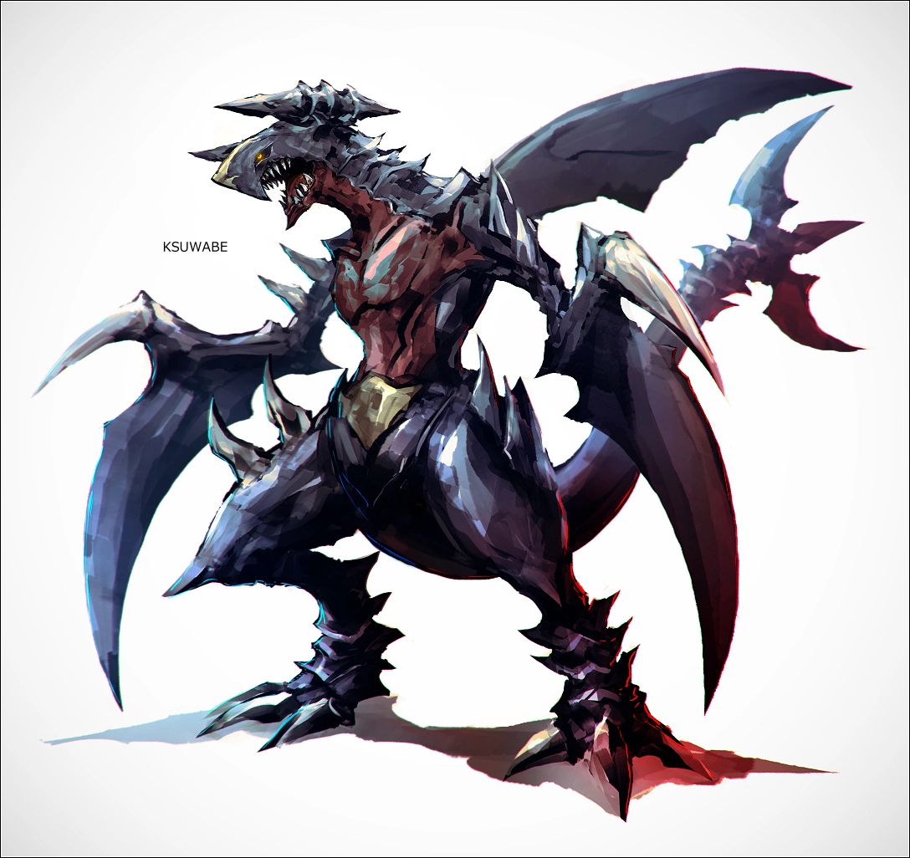

[Torna a campagna](./campaign.md)

# NPC
{:.no_toc}

Ovviamente sono state omesse le informazioni che non avete ancora.

* Indice
{:toc}

## Gilda del Den Fres'tynn


### Kynthea Fres'tynn

 

*Drow F, studiosa di creature magiche*

Donna di relativi 35 anni (240-300), appassionata di creature magiche e delle loro proprietà. Si è fatta conoscere scoprendo un modo di ammansire gli ombrapaci (gloomstalker), diventando la prima persona in grado di controllare delle bestie della Coltre Oscura, seguendo le tracce della nonna Noxis.

La convergenza e le nebbie del lutto hanno esteso in modo entusiasmante le potenzialità dei suoi studi. Spera di poterla sfruttare al meglio.

#### Creature di Kynthea
{:.no_toc}

{: width="200" }

**Anken.** Un esemplare di *kaburias* addomesticato, cosa molto rara.

### Igor del clan Igor

*Goblin M, servitore*

Servitore di clan, come suo padre e il padre di suo padre. 
Da tradizione del clan serve scienziati e studiosi... particolari. Il trisnonno serviva Noxis, nonna di Kynthea.

### Chestibor

 

*Bugbear M, esploratore*

Bugbear dal pelo scuro, quasi nero. 54 anni. Non ha una gamba ma ha una gamba di legno alimentata da un eco della gamba vecchia, letteralmente arto fantasma. L'oggetto magico gli è stato fatto su misura su finanziamento di Kynthea, da parte del Den Thelyss, e offre pochi privilegi (principalmente non dover sorbire terreni scomodi, almeno con un piede).

È l'esploratore di ricognizione della gilda, molto fedele a Kynthea per la gamba magica, e cerca informazioni su creature particolari sparse per Xhorhas.

Menziona spesso delle regole del "bravo esploratore".

### ??? (Fabbro)
*Tiefling (mutante, orco) M, fabbro*

*"Servi della nipote? Hrrm. Io forgio."*

Tiefling verde molto scuro, quasi grigio, con molte chiazze tipo voglie in giro, e corpulento. Il tratto più notevole sono le numerose corna, che non sono solo in testa ma crescono sparse per tutto il corpo. Ne ha in particolare un ammasso sul braccio destro, a metà tra spalla e gomito. Notevoli anche le zanne, una molto grande, l'altra spezzata a metà.

La sua condizione non è unica, ma è abbastanza rara, spesso ritenuta una maledizione di Gruumsh o altri dei: si tratta di un tiefling mutante, la cui progenie infernale si è manifestata in modo incontrollato come per i primi tiefling, e non più contenuta come nei discendenti ora in vita. Sono spesso discriminati, specie se orchi o goblinoidi, a causa della paura che questo possa peggiorare o innescare le maledizioni, vere o fittizie, su quelle razze. Il lato positivo è che gli dona una vita innaturalmente lunga per la sua razza di origine.

### Frau Engel
*Elfa (pallida) F, governante*

*"Entrate pure. Se scopro che incrinate anche solo una mensola..."*

Elfa pallida (non drow, stranamente per il luogo), visibilmente molto vecchia, in modo tale che riesce a superare anche la vaga giovanilità della razza. Faccia perennemente dall'austero al giudicante.

Governante per il Den Fres'tynn da molto tempo, anche dai tempi della nonna di Kynthea. Girano voci che abbia visto la Calamità in prima persona, ma lei non ha intenzione di parlarne. Il suo lavoro lo fa molto bene.

Abbastanza antipatica a quasi tutti, e reciproca.

 
 
 
 

## Den Fres'tynn


Altri membri della casata.

### Noxis Fres'tynn
*Drow F, defunta, arcanista esuberante*

Nonna di Kynthea, uccisa 200 anni fa da folla inferocita (prima ancora che agisse la Guardia dell'Aurora) dati i suoi esperimenti a dir poco non etici con creature mostruose. È stata causa di brutte figure per della famiglia. Possedeva la villa ad Ardeal, il Castello Fres'tynn.

### Houx Fres'tynn
*Drow M, ???*

Fratello di Kynthea, ha finanziato la gilda.

 
 
 
 

## Correlati a PG


### Tariss

 

*Drow F, figlia di Xandra*

Bambina drow, abituata a stare da sola, anche se...

Vuole fare la guerriera da grande.

 
 
 
 
 
 
 
 

## Grifone del deserto


### Shaba-ku di Marquet

 

*Umano M, mercante di oggetti magici*

Mercante viandante. Vestito da viaggio, con uno scettro arcano legato alla cintura e una borsa contenente molti rotoli di carta.

Shaba-ku viene da Marquet, in particolare dagli Altipiani Artigliati. Ha viaggiato a lungo, incontrando Cocò nel deserto, raccogliendo storie da ogni dove. È estremamente interessato a raccogliere storie, sia antiche e del mondo in grande scala, sia delle persone che incontra, e il suo lavoro gli permette di farlo spesso.

### Cyd O'neal

*Umano M, esperto di creature misteriose*

Collega di Shaba-ku, solitamente ha il volto coperto da elmo o altri indumenti, ma tiene i capelli mediamente lunghi in una coda. Indossa armatura leggera, e tiene due sciabole alla cintura. Seguito da un segugio cornuto dall'aspetto molto aggressivo, generalmente mansueto vicino a lui.

Viene da Tal'dorei, zona centrale. Interessato alla storia e alle creature arcane, ha viaggiato molto. Ha incontrato Shaba-ku ed è stato un elemento chiave per addomesticare Cocò. Ora lo accompagna come collega, per scoprire storie.

 
 
 
 

## Den Thelyss


### Mano d'ombra Essek Thelyss

 

*Drow M, prodigio della dunamanzia*

Prodigio della dunamanzia (magia della realtà, gravità e tempo), nonostante l'età relativamente giovane di 127 anni. Ha evidentemente un ruolo importante, al momento a voi non noto. Girano voci su di lui, di diversa natura.

 
 
 
 
 

## Den Hythenos


Include NPC del Faro Radiante.

### Sergente Bharren Coboryn
*Duergar NB, ufficiale del Faro*

325 anni. Tra i più abili guerrieri sotto il casato Hythenos, sono passati molti decenni dai suoi tempi sul campo. Ha ricevuto l'incarico di verificare gli adepti all'appena fondato Faro Radiante. Si diverte con poco, specie a vedere dei dilettanti combattere.

Tante cicatrici, occhio spento, piercing in tinta con lega-barba, cresta.

### Talastree Hythenos

*Drow F, rampolla Hythenos*

Evidentemente ha un ruolo di leadership o controllo con il Faro. Abiti estremamente costosi.

### Membri del Faro

#### ???
*Drow M, avventuriero spocchioso*

Elfo evidentemente figlio di papà, iscritto al Den Hythenos per probabile arroganza.

#### ???
*Drow F, stregone della magia selvaggia*

Attualmente ha la pelle di un verde acceso ha causa di una reazione passata. Capelli corti e un po' bruciati.

 
 
 
 

## Vari


### Bralae Jhalaeir
*Drow F, maga dei fulmini*

Studiosa di magia elementale specializzata nei fulmini, e interessata alle terre da queste parti. Mandante della [missione del Behir](./quest.md#behir). Estremamente bella, a parte che per i capelli ormai permanentemente sparati dati gli esperimenti. Molto entusiasta, forse troppo, riguardo a fulmini e affini.

### Bhutur l'anziano
*Orco M, anziano del villaggio*

Anziano del villaggio di Khuramunz. Affianca Lada al governo, data la sua veneranda età e conoscenza delle genti del villaggio. Sacerdote di Kord, un tempo grande guerriero. Zanne pronunciate, capelli bianchi in coda dietro. Austero ma conosce tutti gli abitanti del villaggio.

### Minori

**Matilda Sempreverde.** *Hobbit F*. Proprietaria di mezz'età della taverna della Pila Corta, unica mezzuoma di Rosonha. 

###### Poi li divido per fazione, intanto ecco
{:.no_toc}