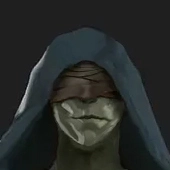

[Torna a campagna](./campaign.md)

# Avventurieri della Gilda
{:.no_toc}

##### Personaggi Giocanti
{:.no_toc}

      
    

    

    

    

    

    

    

    

    

    

    

    <!-- 

 -->

### Script vari

Andate a [pgscripts](/xho/pgscripts) per alcune web-app per i personaggi. Tipo il calcolo danni di Xandra, quella roba lì.





    









    


<section id="{{page.id}}" class="pcsection" markdown="1">

## {{ page.name }}

##### {{ page.player }}

{{ page.content | markdownify }}

</section>



## Pensionati
{:.no_toc}

## Lakario
{:.no_toc}

##### Matte
{:.no_toc}

*Aasimar M, chierico (tomba)*

Lungo individuo umanoide dalla pelle azzurra, e dagli occhi senza pupille.
Venera la Regina dei Corvi, Matrona della Morte.

## Xian

##### Gimmy
{:.no_toc}

*Goblin M, monaco (ego astrale)*

Goblin cieco, con bende che coprono gli occhi, anche se ha una incredibile
capacità di percepire i dintorni. Dopo l'addestramento nel monastero sui 
Monti Cinerei, viaggia per il mondo per acquisire conoscenza. 
Esperto di medicina.
