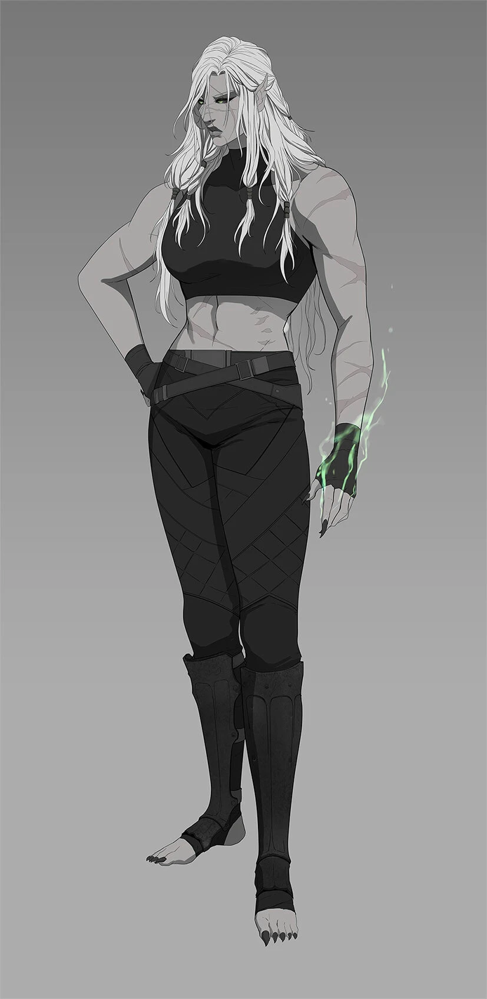
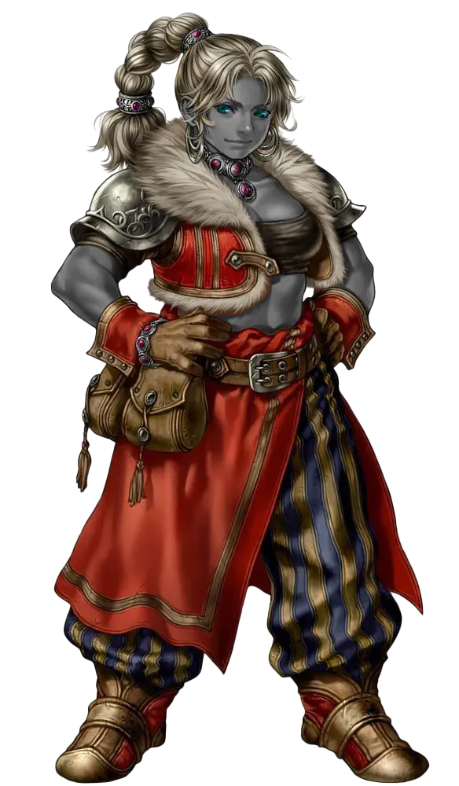
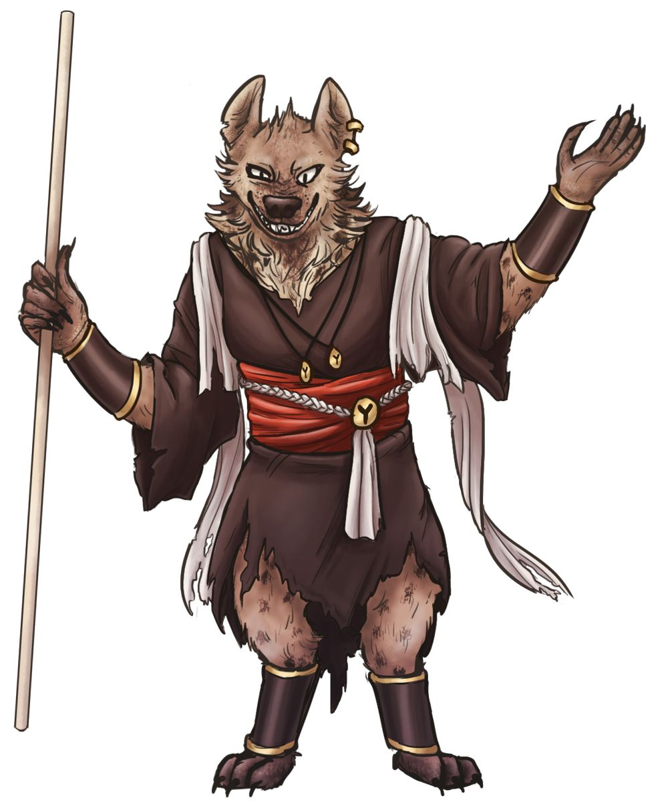
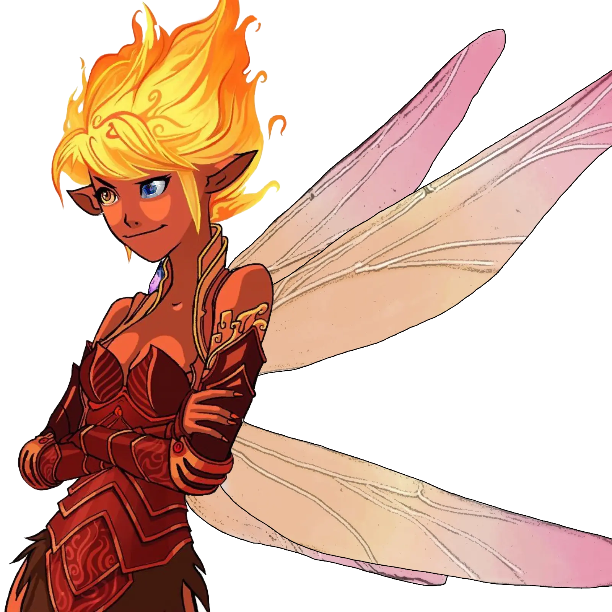
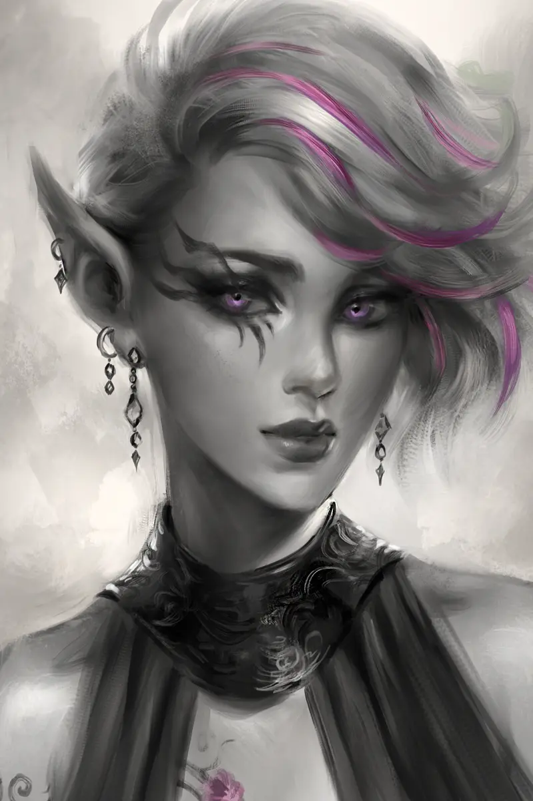
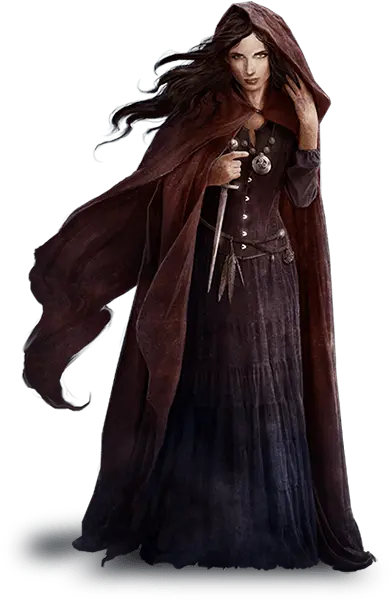

[Torna a campagna](./campaign.md)

# Avventurieri della Gilda
{:.no_toc}

##### Personaggi Giocanti
{:.no_toc}

      
    

    

    

    

    

    

    

    

    

## Xian

##### Gimmy
{:.no_toc}

*Goblin M, monaco (ego astrale)*

Goblin cieco, con bende che coprono gli occhi, anche se ha una incredibile
capacità di percepire i dintorni. Dopo l'addestramento nel monastero sui 
Monti Cinerei, viaggia per il mondo per acquisire conoscenza. 
Esperto di medicina.

## Xandra

##### Fede
{:.no_toc}

{: width="250" }

*Mezzorca (drow) F, guerriero (maestro di battaglia)*

Enorme donna armata di falcione, di poche parole ma un mercenario abile.

È la madre di [Tariss](./npc#tariss), che lascia spesso da sola per
il lavoro.

## Aris

##### Matte
{:.no_toc}

*Aasimar M, warlock (lama del sortilegio)*

Lungo individuo umanoide dalla pelle azzurra, e dagli occhi senza pupille.
Il suo patto con la Morte (nello specifico, Thanathos) è manifestato nella sua
arma, una grande falce con un occhio. Caccia i non-morti che hanno violato il
ciclo della vita.
Abbastanza impulsivo, sembrerebbe.

## Kir

##### Jack
{:.no_toc}

{: width="400" }

*Tiefling (zariel) M, barbaro (zelota)*

Nome completo Lakerkir, forzuto tiefling che è sempre un buon compagno di bevute.
È un seguace di Kord, il Signore delle Tempeste, la cui furia tonante incarna quando
entra in ira.

## Kess

##### Andre
{:.no_toc}

{: width="325" }

*Duergar F, guerriero (samurai)*

Nana dall'identità spesso celata dall'elmo vox camuffatore di voce. Ha un braccio prostetico
con diverse sorprese, che può cambiare a suo piacimento.

## Willow

##### Salo
{:.no_toc}

{: width="325" }

*Gnoll M, chierico (dominio della vita)*

Enorme individuo completamente bendato, dall'aspetto minaccioso che in realtà cela una persona
timida. La fede in Pelor, il Padre Sole guida i suoi notevoli poteri curativi. 

È accompagnato da diverse creature (o circa): il suo mantello-mimic, e un piccolo elementale
del tè, che come dice il nome, beh, fa il tè.

## Estia

##### Andre
{:.no_toc}

{: width="325" }

*Fata F, stregone (magia selvaggia)*

Minuscola fatina con capelli infuocati e un animo a tema, la sua magia innata a volte esplode fuori
controllo. Ama il fuoco, forse troppo. 

Un suo occhio è finto, ma ha davanti l'immagine magicamente animata di un dado.

## Nikolaya

##### Fede
{:.no_toc}

    
    

<i>

    Umana
    
Drow

 F, mago (illusione)
</i>

    Anziana donna
    
Giovane drow

che a quanto pare proviene dall'Impero Dwendaliano. Un'esperta
illusionista, quando fa le sue magie dei tatuaggi sul suo braccio
sembrano illuminarsi. Nome completo: Nikolaya Yankovic.

???

##### Kor
{:.no_toc}

{: width="325" }

*Drow (vacuo) F, ladro (esploratore)*

Drow vacua, visibilmente non morta. Estremamente di poche parole per ora, ma molto abile nella navigazione e nella caccia. Sembra poter camminare su i muri.

## Pensionati
{:.no_toc}

## Lakario
{:.no_toc}

##### Matte
{:.no_toc}

*Aasimar M, chierico (tomba)*

Lungo individuo umanoide dalla pelle azzurra, e dagli occhi senza pupille.
Venera la Regina dei Corvi, Matrona della Morte.
